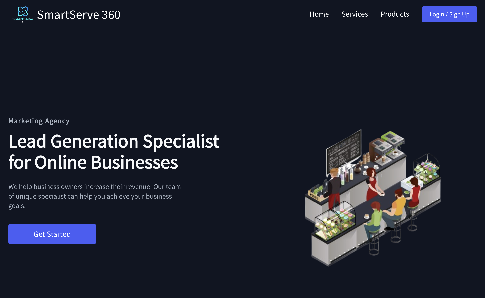

# Smart Serve 360

Publicis Sapient Hackathon Participation Solution in **Improving Customer Experience and Cost Savings in Retail**. Initially using figma to react component transistion for MVP and hosted using AWS Amplify.

## Problem Statement
***Background***: Retailers are undergoing digital transformations that demand innovative solutions to enhance customer experience, engagement, and loyalty. In the Retail sector, personalization, rewards, and immersive shopping experiences are crucial for attracting and retaining customers. Meanwhile, in food retail, Quick Service Restaurants (QSR) require efficient and convenient ordering processes to meet the need for convenience from their customers, and many are challenged to create an experience that is both convenient and differentiated. Both retail sectors also face increasing consumer expectations for cost savings and value.

***Challenge***: The primary problem to address is the need to enhance customer experience, improve perceived customer value, and improve loyalty in the retail or QSR industries. You may explore (but are not limited to) strategies and solutions that can help improve personalization, streamline the customer journey, and improve perceived value for consumers in both online and physical stores. Success is measured by typical retail growth metrics, such as acquisition, conversion, order/ticket size, repeat order rates, customer satisfaction and advocacy.

***Objective***: Create a solution that:

- Identifies key challenges in customer experience and cost-saving opportunities for a retail or QSR client.

- Outlines innovative solutions for enhancing customer experience. Consider innovations like voice-based ordering, personalized recommendations, and AI-powered cost-saving tools.

- Considers the seamless integration of your solution with existing platforms, systems and experiences to provide a seamless experience for customers

- Includes a clear plan to target an existing or new client that your solution can be proposed to.

## Screenshot

